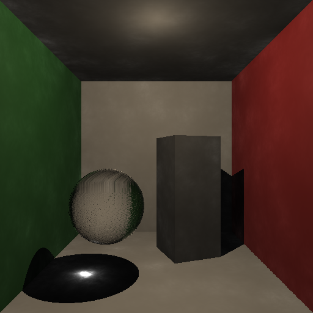

# Alchemist

Alchemist is a raytracer I wrote for my final solo project in the computer graphics course at the University of Waterloo [CS488](https://student.cs.uwaterloo.ca/~cs488/gallery.html). 

I was interested in soft lighting, caustic light effects, and emulating realistic textures. To do so, I implemented [photon mapping](https://en.wikipedia.org/wiki/Photon_mapping), distributed raytracing techniques, and an in-depth material system among other features. Since the renderer was CPU bound, I also leveraged multithreading techniques to massively speed up the rendering process. 

This project was written over the course of a couple weeks, and despite it's rough edges, I'm very proud of the final results!

# Index 
- Sample Images
- Features

## Sample Images
TODO - add collage

More renders can be found in `./SampleImages`. All of the scenes were composed using `lua` and can be found under `./Assets/SampleScenes`.

## Building
This project currently depends on some Lua scene description boilerplate provided by the university. This is copyrighted code that I was not allowed to redstribute, so for the time being, this repo is not in a buildable state.

## Code Structure
Class headers can be found under `include`, and implmentations can be found under `libs`.

## Features
Here is the list of features I implemetented for this renderer. More details about their implementations can be found below.

- various primitive intersections
- bounding boxes
- texture mapping & normal mapping
- normal mapping
- adaptive antialiasing
- reflective and refractive materials
- multithreading
- caustic lighting

### Primitives
TODO - add primitive pics

I implmented intersection algorithms for spheres, cubes, cylinders and cones. Along with primitives, I also implemented rendering for `.obj` models.

### Bounding Boxes
TODO - add bounding box pics

To speed up rendering scenes with `.obj` models, I added rectangular prism bounding boxes. This allows skipping intersection calculations from being run unecessarily.

### Texture Mapping & Normal Mapping
TODO - add texture mapping pics

I added texture mapping and normal mapping for primitives. This allowed for creating some more interesting scenes! This involved making a mapping function from the coordinates on each primitive to a coordinate on a square grid representing the texture.

### Adaptive Antialiasing
I implemented adaptive antialiasing using jittered supersampling to smooth out rough edges. 

Using a templated image kernel class (`include/ImageKernelHelpers.hpp`) I performed a simple edge detection pass using variance. This pass returned all the pixel coordinates corresponding to edges. 

TODO - add the edge detection

I then re-rendered these pixels using multiple rays distributed within the original pixel area and took their average value. Here's the before and after!

TODO - add before/after comparison

### Reflective And Refractive Materials
TODO - pic

Since I was interested in rendering caustics, I added support for reflective and refractive materials. I also added distribution-based ray redirection which allowed for modeling soft reflections and refractions!

### Multithreading
I implemented this renderer purely using the CPU. I used a pool-based queuing system and many threads to massively speed up the rendering process.

### Caustics (via Photon Mapping)

  

Caustics was the most involved feature that I implemented for this project. I achieved this effect using photon mapping! This technique allows for caustic effects to converge much faster than with other rendering techniques such as path tracing.

In short, before doing the main render pass, "photons" are traced exiting from all the light sources in the scene. These photons interact with the scene (passting through refractive materials, and bouncing off of reflective ones), and are collected on diffuse surfaces. Here's a visualization of this photon step where each one is represented by a sphere:

 

During the main rendering pass, i.e. after tracing the path of a ray from the camera out into the scene and hitting a surface, the photons near the intersection are collected and used in the lighting calculation.

You might have realized that there are alot of photons that are produced by this step! To efficiently store the photon information and allow for queries around an intersection point, I wrote a (templated) KD tree class `/include/KDTree.hpp`.

## Next Steps
Here's a list of things I'd like to add to this project next!
- [ ] hand-rolled scene-loading code 
