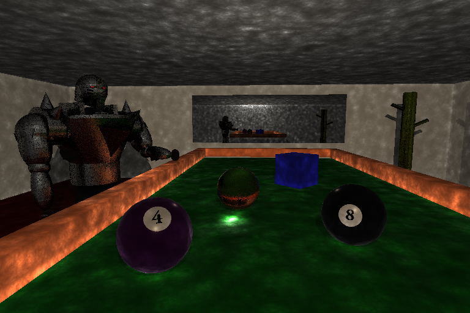
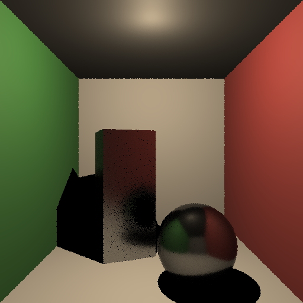

# Alchemist

 

Alchemist is a raytracer I wrote for the final, open-ended, solo project for the computer graphics course at the University of Waterloo [CS488](https://student.cs.uwaterloo.ca/~cs488/gallery.html). 

I was interested in rendering soft lighting, caustic light effects, and emulating realistic textures. To do so, I implemented [photon mapping](https://en.wikipedia.org/wiki/Photon_mapping), distributed raytracing techniques, and an in-depth material system among other features. Since the renderer was CPU bound, I also leveraged multithreading techniques to massively speed up the rendering process. 

This project was written over the course of a couple weeks, and despite it's rough edges, I'm very proud of the final results!

# Index 
- Sample Images
- Features

## Sample Images

More renders can be found in `./SampleImages`. All of the scenes were composed using `lua` and can be found under `./Assets/SampleScenes`.

## Building
This project currently depends on some Lua scene description reading boilerplate provided by the university. This is copyrighted code that I was not allowed to redstribute, so for the time being, this repo is not in a buildable state.

## Features
Here is the list of features I implemetented for this renderer. More details about the implementation can be found below.
- various primitives
- texture mapping
- normal mapping
- adaptive antialiasing
- reflective and refractive materials
- multithreading
- caustic lighting

### various primitives
TODO

### texture mapping
TODO

### normal mapping
TODO

### adaptive antialiasing
TODO

### reflective and refractive materials
TODO

### multithreading
TODO

### Caustics (via Photon Mapping)

  

Caustics was the most involved feature that I implemented for this project. I achieved this effect using photon mapping! This technique allows for caustic effects to converge much faster than with other rendering techniques such as path tracing.

In short, before doing the main render pass, "photons" are traced exiting from all the light sources in the scene. These photons interact with the scene (passting through refractive materials, and bouncing off of reflective ones), and are collected on diffuse surfaces. Here's a visualization of this photon step where each one is represented by a sphere:

 

During the main rendering pass, i.e. after tracing the path of a ray from the camera out into the scene and hitting a surface, the photons near the intersection are collected and used in the lighting calculation.

You might have realized that there are alot of photons that are produced by this step! To efficiently store the photon information and allow for queries around an intersection point, I wrote a (templated) KD tree class `/include/KDTree.hpp`.

## Next Steps
Here's a list of things I'd like to add to this project next!
- [ ] hand-rolled scene-loading code 
